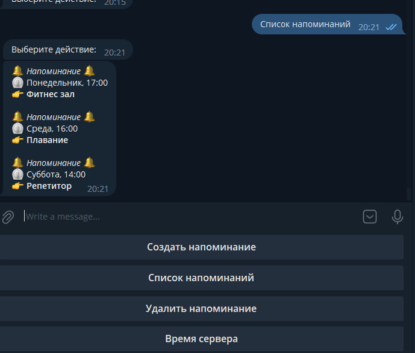

# :bell: TELEGRAM BOT Напоминания :tada:



## Что умеет этот бот?
1. :sunglasses: Добавление напоминаний по конкретной дате или еженедельно в нужный день недели.
2. :open_mouth: Управление напоминаниями (Список+Удаление).
3. :triumph: Напоминает в указанные часы:минуты.
4. :smiley_cat: Напоминание за 24 часа до события. (если необходимо)
5. :smile_cat: Напоминание за 1 час до события. (если необходимо)
6. :scream_cat: Напоминание за 10 минут до события. (если необходимо)

# Установка и запуск

### 1. Создать Бота в телеграме и получить token вашего бота
```
https://t.me/BotFather
```
### 2. Вставить API вашего бота в файле script.js
```
// replace with your token
const bot = new TelegramBot('<YOU API TELEGRAM BOT>', {polling: true});
```
### 3. Запуск скрипта
```
node script.js
```

### Бот работает по типу polling, вам не нужно устанавливать на бота WebHook.

Версия Node и Npm
```
 # node -v
v16.20.0
 # npm -v
8.19.4
```
